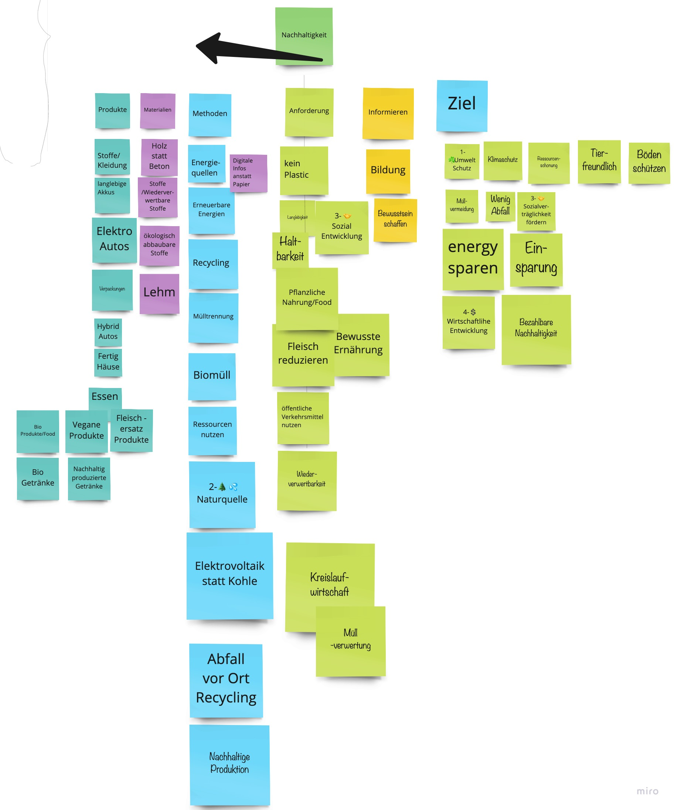
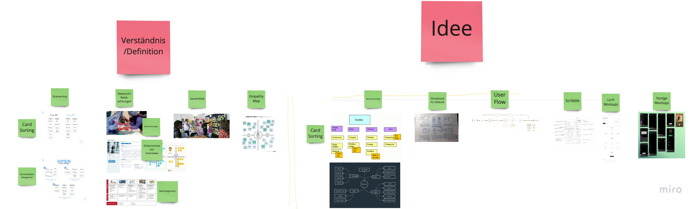

# UI-UX
## User Interfaces, User Experience

Basis: Ein Investor möchte gerne in das Thema Nachhaltigkeit investieren.

Grundidee/Vision: Ich möchte ein Produkt, ein Service, eine App oder Website entwickeln, mit der ich den Menschen das Thema Nachhaltigkeit näher bringe und ihnen dabei helfe, Nachhaltigkeit im Alltag umzusetzen.

Herausforderung: eine neue Idee (für eine Produkt, Funktionen, Anwendungsfälle) zu entwickeln und dafür erste Designs zu entwerfen.

Mögliche Ergebnistypen: grobe Screens, Scribbles, Beschreibungen oder ein erster Klickdummy

Aufgaben: Verständnis bilden, Design/User Research durchführen, Daten/Studien suchen, Ideen entwickeln, ggf. ein grobes Geschäftsmodell dazu, Ideen unfassbar machen.

Materialen-H2
------

Miro
  https://miro.com/app/

Figma
  https://www.figma.com/
  
  

Nützliche Links-H2
------

https://miro.com/app/board/o9J_lTYy4lg=/

https://www.uxbooth.com/articles/empathy-mapping-a-guide-to-getting-inside-a-users-head/

Inhaltlich-H2
------

Empathy Map

Human Centered Design

Persona

Nachhaltiger Konsum im Netz

Milieu

  https://www.bmu.de/fileadmin/Daten_BMU/Pools/Broschueren/umweltbewusstsein_2018_bf.pdf
  
  (seite 15, 25 sind relevant
  
  nachhaltigkeit verbreiten
  
  kultur gruppe mileu nachhaltigkeit
  
Limbic Map

Leitfaden Umweltkommunikation

https://www.yumpu.com/de/document/read/39906201/leitfaden-umweltkommunikation

